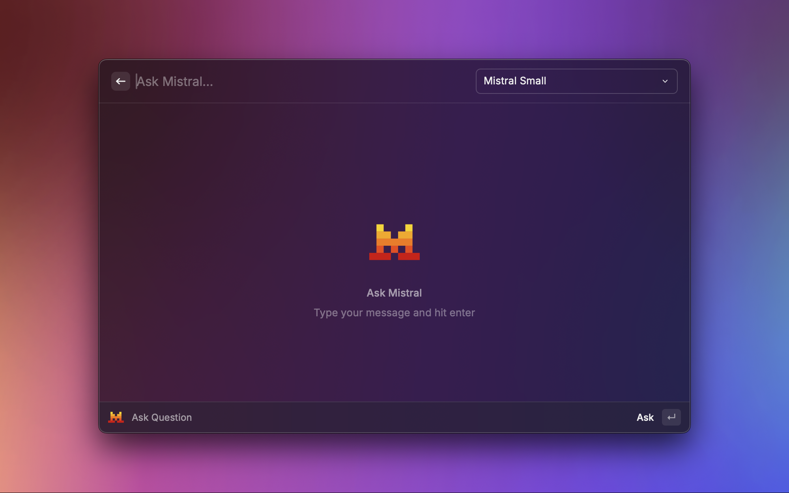

# Mistral

An unofficial extension to use Mistral AI from Raycast

## Features

- Ask questions to Mistral
- Browse your past conversations
- Choose between Mistral Small and Mistral Large

## Setup API Key

Go to the [Mistral AI console website](https://console.mistral.ai/api-keys), create an account if you don't have one, and create a new API key.

## License

[MIT](./LICENSE) © Colin Lienard
